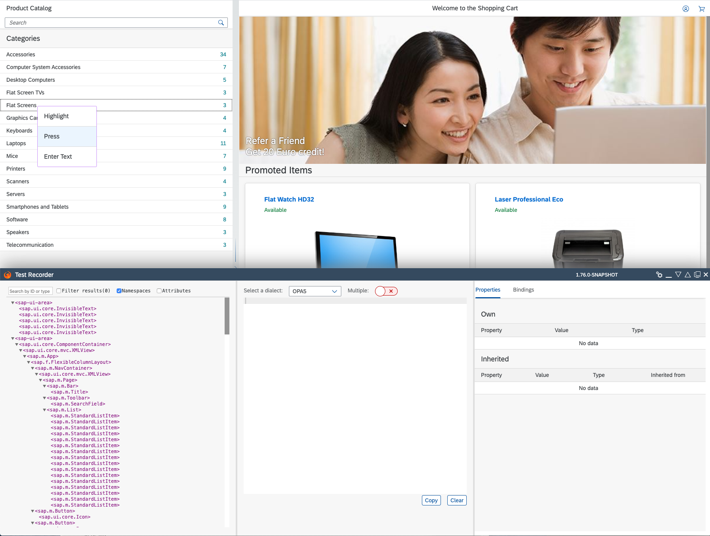
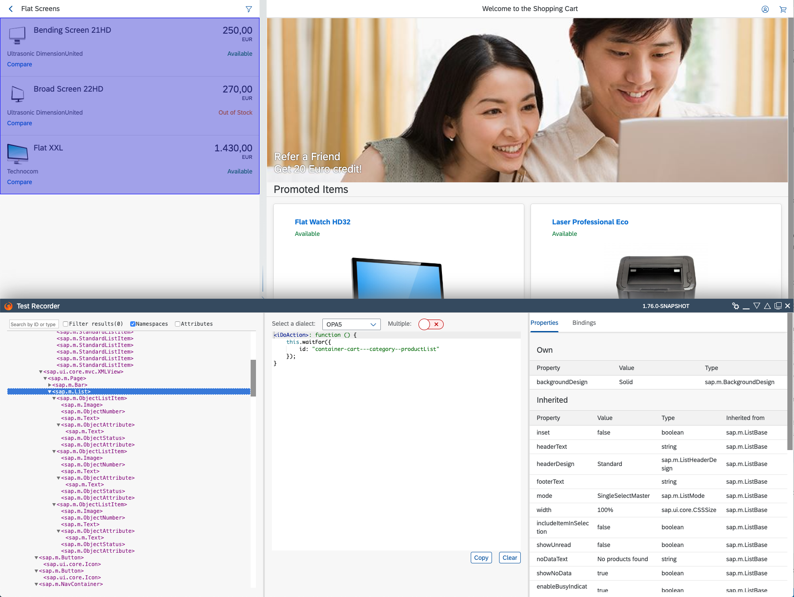

# OPA5 Exercise

**Step 1**

Create the following folders and files under the path **webapp/test**

Add a new folder "integration" below the "test" folder, where we put our journeys.

Put all the page objects into the "pages" subfolder.

A journey contains a sequence of OPA steps that follow a test scenario.
- **webapp/test/integration/ProductJourney.js** - A journey that validates product display.
- **webapp/test/integration/AllJourneys.js** - Includes all journeys and runs them sequentially

Page objects help structuring the integration tests:
- **webapp/test/integration/pages/Home.js** - containing actions and assertions for the home view.
- **webapp/test/integration/pages/Category.js** - containing actions and assertions for the product categories view.
- **webapp/test/integration/pages/Product.js** - containing actions and assertions for the product view.

To run all journeys we need an html file: **webapp/test/integration/opaTests.qunit.html**

If you have serveral test suites e.g. one for OPA test, another for unit tests and you would like to integrate the execution of the test into the CI (Continuous Integration) Build, create an html that includes them:
- **webapp/test/testsuite.qunit.html**

**Step 2**

Implement **webapp/test/testsuite.qunit.html**

This file will be called by the test runner to execute all included tests.

```html
<!DOCTYPE html>
<html>
	<head>
		<title>QUnit TestSuite</title>
		<script src="../resources/sap/ui/qunit/qunit-redirect.js"></script>
		<script>
			/**
			 * Global method that is called by the Selenium/QUnit framework to retrieve the test suites.
			 */
			function suite() {
				// init new test suite
				var oSuite = new parent.jsUnitTestSuite();
				var sContextPath = location.pathname.substring(0, location.pathname.lastIndexOf("/") + 1);
				// add test pages to the test suite
				oSuite.addTestPage(sContextPath + "integration/opaTests.qunit.html");
				return oSuite;
			}
		</script>
	</head>
	<body>
	</body>
</html>
```

**Step 3**

Implement **webapp/test/integration/opaTests.qunit.html**

This file contains our test suite for all OPA tests of the app. 

```html
<!DOCTYPE html>
<html>
<head>
	<title>Integration tests for Shopping Cart Journeys</title>

	<meta charset="utf-8">

	<script
		id="sap-ui-bootstrap"
		src="https://openui5.hana.ondemand.com/resources/sap-ui-core.js"
		data-sap-ui-resourceroots='{
			"sap.ui.demo.cart" : "../../",
			"sap.ui.demo.mock": "https://openui5.hana.ondemand.com/test-resources/sap/ui/documentation/sdk/"
		}'
		data-sap-ui-theme='sap_belize'
		data-sap-ui-language="en"
		data-sap-ui-animation="false"
		data-sap-ui-compatVersion="edge"
		data-sap-ui-async="true">
	</script>

	<link rel="stylesheet" type="text/css" href="https://openui5.hana.ondemand.com/resources/sap/ui/thirdparty/qunit-2.css">

	<script src="https://openui5.hana.ondemand.com/resources/sap/ui/thirdparty/qunit-2.js"></script>
	<script src="https://openui5.hana.ondemand.com/resources/sap/ui/qunit/qunit-junit.js"></script>

	<script src="opaTests.qunit.js"></script>
</head>
<body>
	<div id="qunit"></div>
	<div id="qunit-fixture"></div>
</body>
</html>
```

**Step 4**

Implement **webapp/test/integration/AllJourneys.js** 

Here we load all required modules including QUnit, OPA5, OPA5 test library for Fiori Elements and all detail journeys and required pages.

```js
sap.ui.define([
	"sap/ui/test/Opa5",
	"./arrangements/Startup",
	"./ProdcutJourney",
], function (Opa5, Startup) {
	"use strict";

	Opa5.extendConfig({
		arrangements: new Startup(),
		viewNamespace: "sap.ui.demo.cart.view.",
		autoWait: true
	});
});
```

**Step 5**

Implement **webapp/test/integration/ProdcutJourney.js** 

We will create a single test to validate that the home screen, categories and products are loaded correctly.
The scenario follows these steps:
1. Start the application
2. Validate that category list is visible.
3. Press on the "Flat Screens" category
4. Validate that "Flat Screens" is loaded.
5. Validate that the product list is visible.
6. Teardown the application.


```js
/* global QUnit */

sap.ui.define([
	"sap/ui/test/opaQunit",
	"./pages/Home",
	"./pages/Category",
], function (opaTest) {
	"use strict";

	QUnit.module("Buy Product Journey");

	opaTest("Should see the category list", function (Given, When, Then) {
		// Arrangements
		Given.iStartMyApp();

		// Assertions
		Then.onTheHomePage.iShouldSeeTheCategoryList();
	});

	opaTest("Should see the product list", function (Given, When, Then) {
		// Actions
		When.onTheHomePage.iPressOnTheFlatScreensCategory();

		// Assertions
		Then.onTheCategoryPage.iShouldBeTakenToTheFlatScreensCategory().
			and.iShouldSeeTheProductList();

		// Cleanup
		Then.iTeardownMyApp();
	});
});
```

**Step 6**

Implement **webapp/test/integration/pages/Home.js**

This file will contain actions and assertions which could be used for test cases of the home page.
To create the selectors we can use OPA Test Recorder. It can be started via keyboard combination:
 - For Windows: Ctrl+Alt+Shift+T
 - For Mac: Control+Option+Shift+T

The TestRecorder should be loaded in a pop-up. Then you can use it for resolving the selectors. 
Here you have to add the action for selecting category and an assertion for loaded category list.
To create the press action you can easily generate and copy it from Test Recorder. Just right click on the required field and select "Press". Then a snipped will appear and you can copy directly in your test code. 
<p align="center">
	
</p>

For the assertion you just have to find the category list item in TestRecorder and to get the selector. Then add the success assertion.
<!--  -->
<p align="center">
	
</p>

```js
sap.ui.define([
	"sap/ui/test/Opa5",
	"sap/ui/test/matchers/BindingPath",
	"sap/ui/test/actions/Press"
], function (
	Opa5,
	BindingPath,
	Press) {
	"use strict";

	Opa5.createPageObjects({
		onTheHomePage : {
			viewName : "Home",

			actions : {
				// Add your iPressOnTheFlatScreensCategory function here

			},

			assertions: {
				iShouldSeeTheCategoryList :  function () {
					return this.waitFor({
						// your selector
						// success : function () {
						// 	Opa5.assert.ok(true, "Found the category List");
						// }
					});
				}
			}
		}
	});
});

```

**Step 7**

Implement **webapp/test/integration/pages/Category.js**

This file will contain assertions which could be used for test cases of the product categories.
You can again use TestRecorder to generate and copy needed selectors.

```js
sap.ui.define([
	"sap/ui/test/Opa5",
	"sap/ui/test/matchers/Properties"
], function (
	Opa5,
	Properties) {
	"use strict";

	Opa5.createPageObjects({
		onTheProductPage: {
			viewName: "Product",

			assertions: {
				// Add your iShouldSeeTheProductTitle function here 

				// Add your iShouldBeTakenToTheFlatScreensCategory function here
			}
		}
	});
});
```

**Step 8**

Run OPA tests by calling **npm run test** to execute all journeys.
